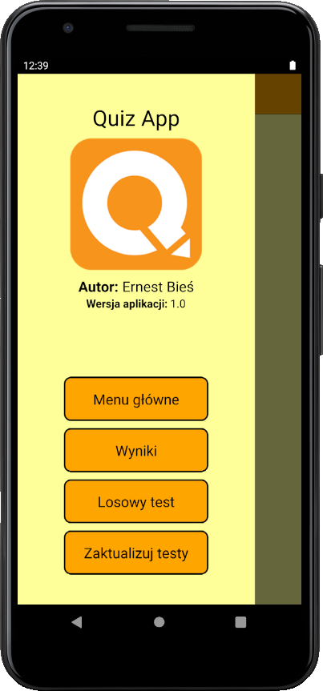

# Quiz

Mobile application that allows you to solve on-line tests. Tests are downloaded from an external server. The user has the option of solving a specific test, has a specific time to answer a specific question. In addition, they can choose a random test and view all their and other users' results. The application has a drawer menu that makes it easy to access all screens. 

# Screenshots

